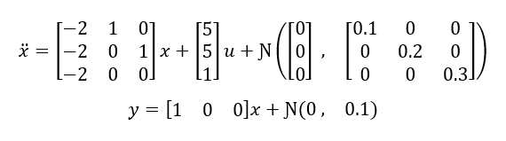
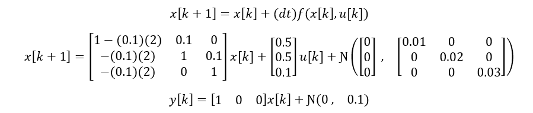
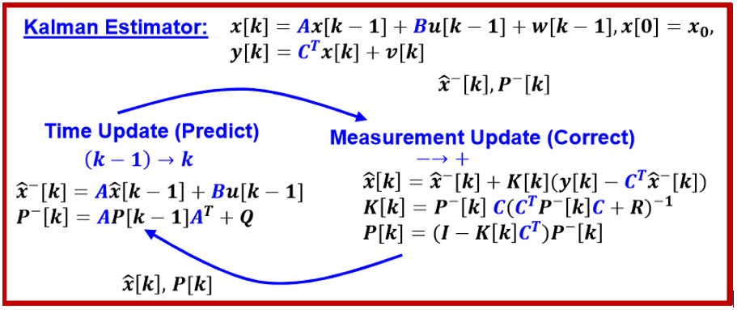
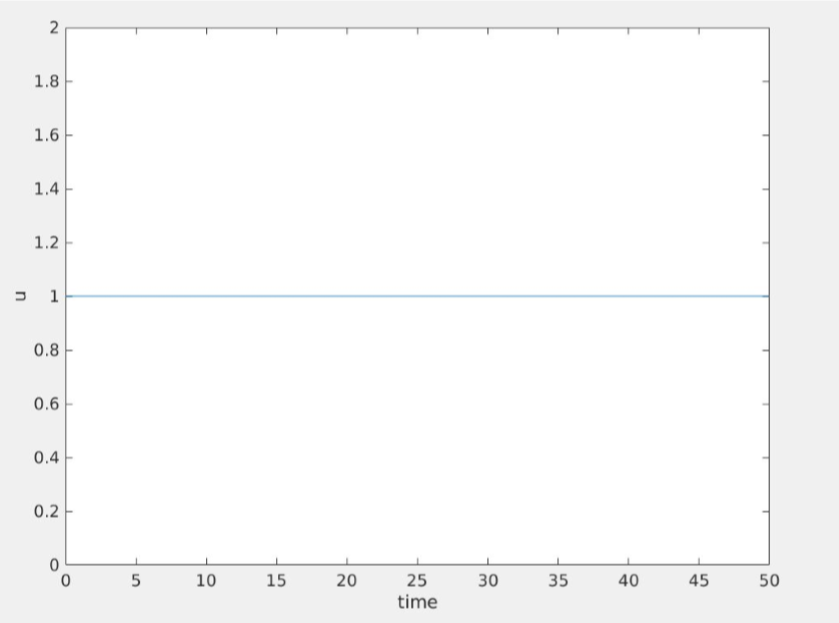
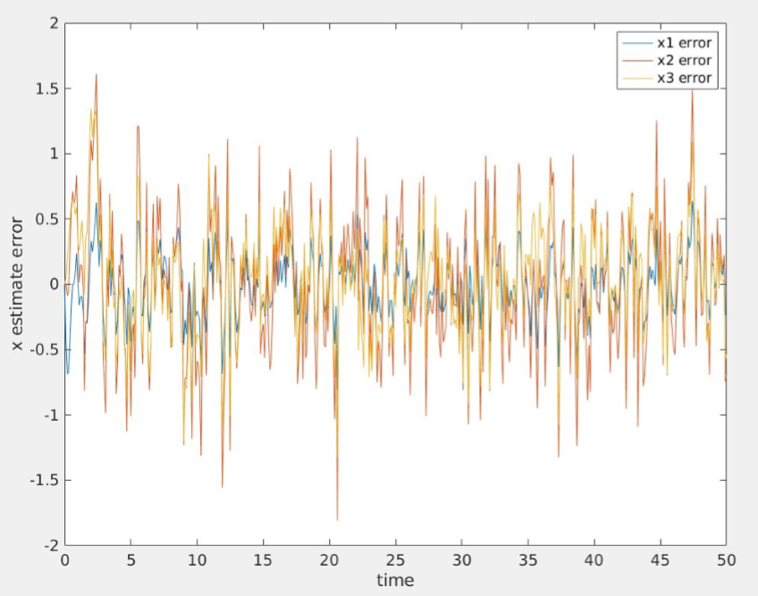
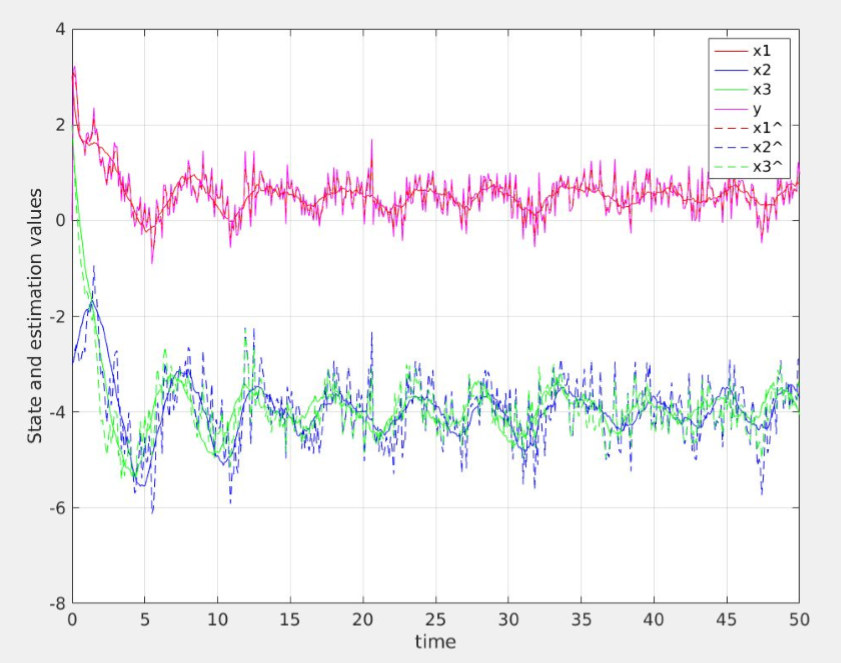
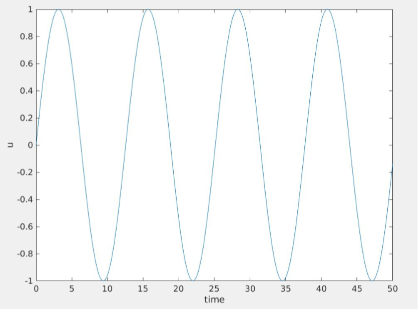
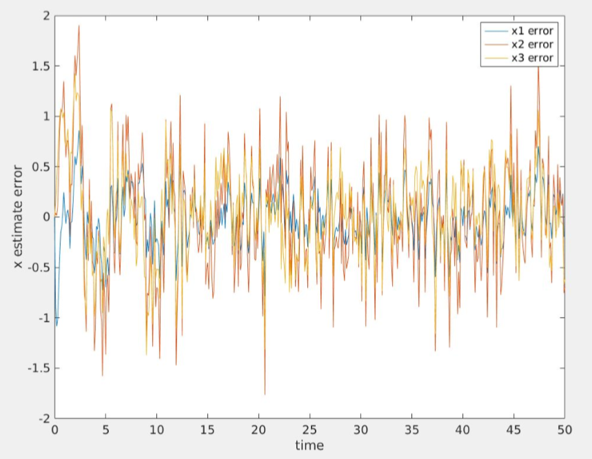
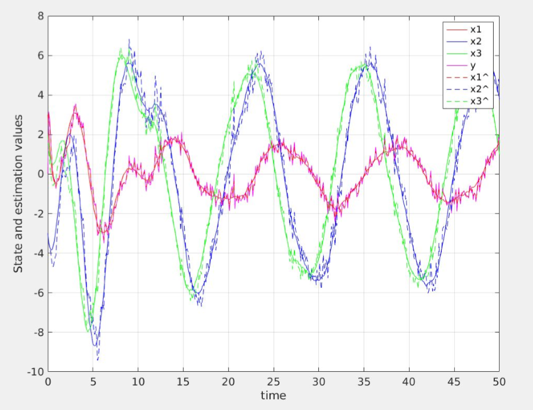

# Discrete_Kalman
Discrete Kalman Filter Application

The following is an example of an application of a Discrete time Kalman Filter for state estimation for a State-Space system. The state space system is 3x3 but may easilt be extended. The system is SISO and is written in MATLAB.

The discrete time approximation for the system (to be used in simulation) is as follows:

The procedure for generating state estimates is as follows:
1) Prediction using previous estimate
2) Correction using measurement

For a constant input case u(t) = 1:

For a sinusoidal input case u(t) = sin(0.5t):

The system is completely observable (can be assured with the observability matrix). In both input cases it appears that the state estimates track the actual state reasonably well. 
 
It should also be mentioned that this is the ideal case in which the sensor noise (R) was assumed to have the true value (0.1), however, in application the true sensor noise variance is often not known where assuming a higher value of R would result in a fast response and bad tracking, while assuming a lower value of R would result in a slow response with reasonable tracking. Here in both cases we see an ideal response with good tracking of the state. 
 
Unlike the Leunberge observer which is deterministic, the Kalman Filter explicitly incorporates a noise model for both state and output processes and is more appropriate and, in general, performs better for stochastic systems. This is our case as we have noise in both our plant and measurement model. On the contrary the Leunberger observer needs sufficient excitation to ‘overcome’ the noise and produce good state estimates.
